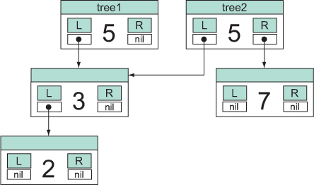
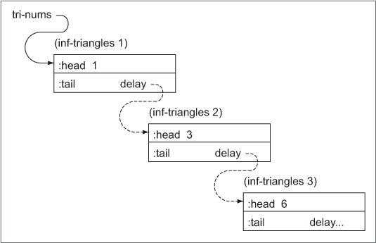

# 6장. 지연성과 불변성

## 불변성이란?

메모리에 할당 된 값을 변경하지 않는 것

### 예정된 불변 vs 합의에 의한 불변

예정된 불변: 모든 속성이 생성 시점에 정의되고, 그 이후에는 변경할 수 없는 것

합의에 의한 불변: 자바로 예를 들면, 다음과 같은 내용이 필요함

1. 모든 필드가 final로 선언 되어야 함
2. 객체를 생성하는 과정에서 this를 통한 객체의 참조가 불가능 해야함
3. 내부의 불변 객체들은 클래스 안에서 복사만 허용되고 외부로 참조되지 않아야 함.

클로저는 언어의 특징 중 하나로 불변 데이터 구조를 제공함

## 불변성을 사용하는 이유

1. 객체의 상태 예측이 용이해짐

객체의 상태는 시스템의 동작에 따라 "가능한 종류의 범위 내에서 제한적으로 변화"

2. 동일성의 의미가 생김

가변성의 세계에서는 생성 시점에 동일한 객체라고해도 변경이 가능하기 때문에 의미가 없지만

불변성의 세계에서는 현재 동일한 객체는 항상 동일함을 보장함

3. 공유가 쉬워짐

어떤 객체가 변하지 않는다는 확신이 있다면, 해당 객체의 참조를 제공함으로 간편하게 공유 가능

4. 간접성 감소

자바: 참조하고 있는 데이터가 가변성을 가짐

클로저: 데이터는 불변이고, 참조 자체가 다른 데이터를 가르키게됨

## 구조적 공유: 영속적 구조

list는 가장 단순한 형태의 공유 구조 타입이다.

```clojure
(def baselist (list :apple :tomato))
(def lst1 (cons :banana baselist))
(def lst2 (cons :orange baselist))

(= (next lst1) (next lst2)) => true
(identical? (next lst1) (next lst2)) => true
```
`lst1` `lst2`가 공유하는 부분은 단순히 같은 것이 아니라, 같은 메모리 주소를 가르키고있음.

아래는 간단한 이진트리 구현이다.

```clojure
;; 트리를 전위 순회하며 값을 concat시킴
(defn xseq [t]
  (when t
    (concat (xseq (:L t)) [(:val t)] (xseq (:R t)))))

(defn xconj [t v]
  (cond
    (nil? t) {:val v :L nil :R nil}
    (< v (:val t)) {:val (:val t)
                    :L   (xconj (:L t) v)
                    :R   (:R t)}
    :else {:val (:val t)
           :L   (:L t)
           :R   (xconj (:R t) v)}))

;; 키워드가 함수 호출 위치에 있는 경우 맵을 parameter로 받아
;; 자기 자신을 조회하는 함수로 동작
;; 코드 작성 스타일에 따라 선택하는 문제이지만
;; 키워드가 로컬 혹은 var로 저장 되어있다면 get을 사용하는 편이
;; '조회'로써의 의도가 명확해짐
(let [some-local :a-key]
  (get {:a-key 42} some-local)) ;; good
(let [some-local :a-key]
  (some-local {:a-key 42})) ;; bad

(def tree1 (xconj nil 5))
(def tree2 (xconj tree1 3))
(def tree3 (xconj tree2 2))
(xseq tree3) => (2 3 5)
(def tree4 (xconj tree3 7))
(xseq tree4) => (2 3 5 7)
(identical? (:L tree3) (:L tree4)) => true
```


위 예제를 통해 알 수 있는 영속적 컬렉션이 공통적으로 갖는 몇가지 특징

- 모든 '변경'은 일단 새로운 루트 노드를 생성하고, 새 값이 삽입될 위치의 트리 경로에 새 노드를 추가
- 값과 변경되지 않는 가지가 복사되는 것이 아니라, 기존의 노드에서 새 노드로 참조가 복사됨
- 완전히 스레드에 안전하기 때문에 확인하기 쉽다. 즉, `xconj`를 호출하기 전에 존재하던 객체들도 어떤 방법으로든 변경되지 않으며, 새로 생성된 노드들도 리턴 되기 전의 마지막 상태다.

하지만 그럼에도 위 코드가 좋은 코드가 아닌 이유

- 이진 트리 방식
  - 클로저의 정렬된 컬렉션은 이진트리지만, 해시 맵, 해시 셋, 벡터 등은 모두 노드당 32개의 가지를 가지게 되어 깊이를 줄일 수 있음.
- 숫자 외에 다른 값은 저장 할 수 없음
- 트리의 길이가 깊어지면 오버플로우 발생 가능
- xseq가 지연 시퀀스가 아닌, 트리 전체를 복사하는 방식
- 비균형적인 트리를 생성함.
  - self balanced tree중 하나인 Red-Black 트리를 사용하여 검색 효율을 유지한다.


## 지연

함수에 인자가 입력되게되면 즉시적으로 평가하는 것이 아닌, 계산이 필요한 시점이 되어서 그 함수 인자를 평가하는 것을 보고 '게으르다' 라고 표현한다.

이 장에서는 지연을 이용하여 다음의 것들을 알아본다.
- 계산 조합의 폭발적인 증가로 불필요한 계산이 수행되거나 종료되지 않는 등의 문제를 해결하기 위해 지연을 어떻게 활용하는지?
- 무한 시퀀스를 활용하는 방법
- 클로저의 `delay`와 `force`를 사용하여 지연 구조를 만드는 방법

### 논리곱을 사용한 지연

```java
if ( obj != null && obj.isWhatiz() ) {
  ...
}
```

단축 평가 연산자인 `&&`이 없었다면 매번 NullPointerException을 발생 시켰을 것이다.

아래는 클로저의 if 표현식을 이용한 단축 평가 코드이다.
```clojure
(defn if-chain [x y z]
  (if x
    (if y
      (if z
        (do
          (println "Made it!")
          :all-truthy)))))

(if-chain () 42 true)
(if-chain true true false)

;; 아래와 같은 and 매크로를 이용하여 훨씬 간결하게 작성이 가능하다.
(defn and-chain [x y z]
  (and x y z (do (println "Made it!") :all-truthy)))

(and-chain () 42 true)
(and-chain true true false)
```

### 지연 시퀀스 생성 이해하기

다음의 `steps`는 시퀀스를 인자로 받아 중첩 구조를 생성하는 함수이다.
```clojure
(steps [1 2 3 4]) => [1 [2 [3 [4 []]]]]

;; 단순하게 재귀로 구현한 버전
(defn rec-step [[x & xs]]
  (if x
    [x (rec-step xs)]
    []))

(rec-step (range 200000))
;=> StackOverflowError clojure.lang.longrange.first
;; 스택 오버 플로우가 발생한다.
```

이를 해결하기 위해 지연을 활용할 수 있다.

지연을 활용하기 전에 `lazy-seq` 사용방법은 다음과 같다.
- 지연 시퀀스를 생성하는 표현식의 가장 바깥쪽의 `lazy-seq` 매크로를 사용하자
- 연산 중에는 다른 시퀀스를 사용해야 할 경우가 있다면 `next`대신 `rest`를 사용하자
- 시퀀스를 처리할 때는 가능한 고차 함수를 사용하자.
- 시퀀스의 헤드를 붙들고 있지 말자.

들어가기전에 잠깐 `rest`와 `next`의 비교
```
```

다음은 `lazy-seq`를 활용하여 스택 오버플로우가 발생하지 않도록 수정한 버전이다.
```clojure
(defn lz-rec-step [s]
  (lazy-seq
    (if (seq s)
      [(first s) (lz-rec-step (rest s))]
      [])))

(lz-rec-step [1 2 3 4])
;=> (1 (2 (3 (4 ()))))

(class (lz-rec-step [1 2 3 4]))
;=> clojure.lang.LazySeq

(dorun (lz-rec-step (range 200000))) ;; 이제 스택오버플로우가 발생하지 않음
```
위 코드에서도 `lazy-seq` 사용 방법의 1, 2번이 지켜진 것을 확인할 수 있다. 


### 헤드 무시하기

클로저에서 지연을 사용할 때 가장 큰 장점은 연산 중의 중간 결과 값들을 모두 실체화 하지 않도록 막아준다는 점이다. 하지만, 만약 시퀀스의 헤드를 붙잡고 있게 된다면, 그 시퀀스는 가비지 컬렉션에서 제외될 것이다.
시퀀스의 헤드를 붙들고 있게 되는 가장 간단한 조건은 **"로컬에 바인딩 하는 것"** 이다.

```clojure
(let [r (range 1e9)]
  (first r)
  (last r))
;=> 999999999
;; 컴파일러가 (last r)을 처리하면서 r을 더이상 보존 하지 않아도 된다는 것을 추론하여 정리해줌

(let [r (range 1e9)]
  (last r)
  (first r))
; java.lang.OutOfMemoryError: Gc overhead limit exceeded
;; 전체적인 연산을 수행하는데, 헤드를 계속 유지할 필요가 있기 때문에 안전하게 정리할 수 없음
```
위와 같은 경우 컴파일러가 연산 순서를 조정하여 해결하는 방법이 있지만, 그렇게 하려면 연관된 모든 함수가 **순수함수**인 것이 보장 되어야 가능함. 결론적으로 연산 순서가 중요하지 않다고 보장할 수 없기 때문에, 클로저는 연산 순서를 재조정하지 않음.

### 무한 시퀀스 활용하기

무한 시퀀스를 사용하는 것은 어디에 도움이 될까? -> 선언적 솔루션을 만드는데 도움이 됨

아래의 삼각수를 계산하는 함수로 예를 들어보자.

```clojure
(defn triangle [n]
  (/ (* n (+ n 1)) 2))

(triangle 10)
;=> 55
```

위의 코드에 문제가 있지는 않지만, 다음 예제와 같이 모든 삼각수의 시퀀스를 정의하면
원하는 항목을 찾는 '질의'를 할 수 있게 됨.

```clojure
(map triangle (range 1 11))
(def tri-nums (map triangle (iterate inc 1)))
(take 10 tri-nums) ;; 삼각수 10개 마치 sql문과 같이 사용 (ex. select * from triangles limit 10)
(take 10 (filter even? tri-nums)) ;; (select * from triangles where num % 2 = 0 limit 10)
(nth tri-nums 99) ;; 가우스가 계산했던 숫자
(double (reduce + (take 1000 (map / tri-nums)))) ;; 두 가지 연산을 조합
(take 2 (drop-while #(< % 10000) tri-nums)) ;; 10,000보다 큰 앞쪽 숫자 2개
```

위와 같이 삼각수의 무한 시퀀스를 정의하고, 필요한 만큼 특정 항목만을 취해서 계산할 수 있게됨.

### delay와 force 매크로

클로저에서 제공하는 두가지 지연 매커니즘

- 요구에 의한 호출(call-by-need) : 8장에서 자세히 설명
- 명백한 지연: `delay`와 `force`를 사용하는 것.

간단히 말하면 `delay`매크로는 `force`함수를 사용해서 강제로 평가하기 전까지
표현식의 평가를 연기함.

```clojure
(defn defer-expensive [cheap expensive]
  (if-let [good (force cheap)]
    good
    (force expensive))) ; 참이 리턴될때만 then 부분을 실행

(defer-expensive (delay :cheap)
                 (delay (do (Thread/sleep 5000) :expensive)))
;=> cheap

(defer-expensive (delay false)
                 (delay (do (Thread/sleep 5000) :expensive)))
;=> expensive
```

위와 같은 기능을 직접 구현할 수 있지만 `delay/force`를 사용했을 때 아래와 같은 기능을 기본적으로 제공해주는 장점이 있다.
- `delay?`를 통해 지연된 연산을 명시적으로 확인 가능
- 계산을 캐시해두기 때문에 표현식이 필요할 때 한번만 평가됨

다음은 앞서 살펴본 삼각수 예제를 `delay`와 `force`를 이용한 버전이다.

```clojure
(defn inf-triangles [n]
  {:head (triangle n)
   :tail (delay (inf-triangles (inc n)))})

(defn head [l] (:head l))
(defn tail [l] (:tail l))

(def tri-nums (inf-triangles 1))

(head tri-nums)
;=> 1
(head (tail tri-nums))
;=> 3
(head (tail (tail tri-nums)))
;=> 6
```

위 코드는 아래와 같이 표현될 수 있음



`head`와 `tail`만으로도 전체 연결을 탐색할 수 있지만, 그보다는 좀 더 복잡한 함수를 위한 기반 함수로 사용하는 것이 좋은 방법.

```clojure
(defn taker [n l]
  (loop [t n, src l, ret []]
    (if (zero? t)
      ret
      (recur (dec t) (tail src) (conj ret (head src))))))
(defn nthr [l n]
  (if (zero? n)
    (head l)
    (recur (tail l) (dec n))))
(taker 10 tri-nums)
;=> [1 3 6 10 15 21 28 36 45 55]
(nthr tri-nums 99)
;=> 5050
```